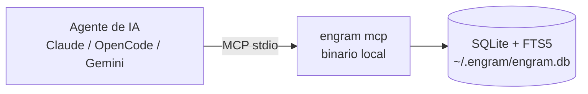
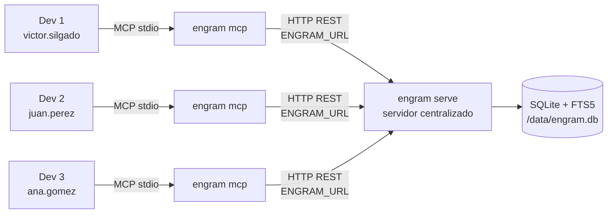
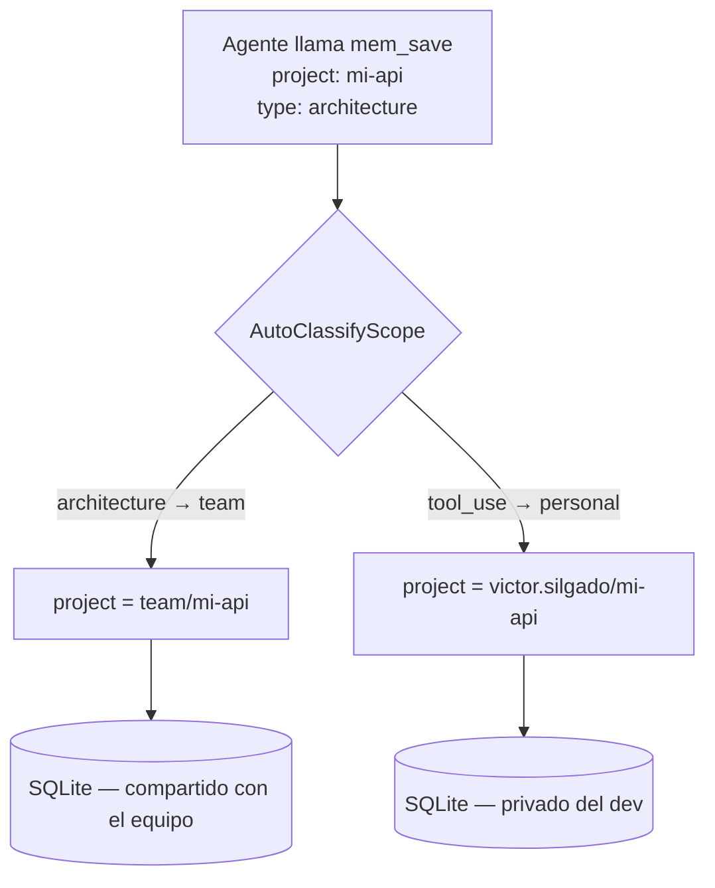

# engram-dotnet

> **engram** `/ˈen.ɡræm/` — *neurociencia*: la huella física de un recuerdo en el cerebro.

Memoria persistente para agentes de IA. Puerto no oficial a **.NET 10 C#** del proyecto original [engram](https://github.com/Gentleman-Programming/engram) de [Alan Buscaglia (@Gentleman-Programming)](https://github.com/Gentleman-Programming).

Compatible con todos los plugins existentes (Claude Code, OpenCode, Gemini CLI, Codex) — solo se cambia `ENGRAM_URL`.

---

## Créditos y atribución

Este proyecto es una reimplementación en .NET 10 C# del binario original en Go. **Todo el mérito del diseño, la arquitectura y la idea pertenece al proyecto original.**

- **Proyecto original**: [Gentleman-Programming/engram](https://github.com/Gentleman-Programming/engram)
- **Autor original**: Alan Buscaglia
- **Licencia original**: MIT

---

## ¿Por qué este port?

El proyecto original está escrito en Go. En entornos donde el equipo trabaja con .NET, este port permite usar Engram sin introducir una nueva cadena de tooling. Además está diseñado para correr como **servidor compartido** — una sola instancia por equipo en lugar de una por desarrollador.

| Característica | engram (Go) | engram-dotnet (.NET 10) |
|---|---|---|
| Lenguaje | Go 1.25 | C# / .NET 10 LTS |
| Binario | Single binary (goreleaser) | Self-contained linux-x64 |
| HTTP API | ✅ | ✅ idéntica |
| MCP server | ✅ | ✅ idéntico (15 herramientas) |
| Git sync | ✅ | ✅ idéntico |
| Auth JWT | Opcional | Opcional (`ENGRAM_JWT_SECRET`) |
| TUI | Bubbletea | No incluida en v1 |
| Obsidian export | ✅ | Fase 2 |
| Servidor compartido | 1 instancia por dev | ✅ diseñado para equipos |

---

## Cómo funciona

### Modo local



### Modo equipo (servidor compartido)



### Namespacing automático (team vs personal)



---

## Quick Start

### Requisitos

- Linux x64 (para correr el binario publicado)
- .NET 10 SDK (solo para compilar desde fuente)
- Sin runtime externo requerido en producción — el binario es self-contained

### Compilar desde fuente

```bash
git clone https://github.com/efreet111/engram-dotnet
cd engram-dotnet
dotnet publish src/Engram.Cli -c Release -r linux-x64 --self-contained -o dist/
```

El binario queda en `dist/engram`.

### Iniciar el servidor

```bash
# HTTP API en puerto 7437 (default)
./engram serve

# Ver que responde
curl http://localhost:7437/health
```

---

## Configuración

Todas las opciones se controlan via variables de entorno:

| Variable | Default | Descripción |
|---|---|---|
| `ENGRAM_DATA_DIR` | `~/.engram` | Directorio de datos (SQLite + sync chunks) |
| `ENGRAM_PORT` | `7437` | Puerto del servidor HTTP |
| `ENGRAM_PROJECT` | — | Proyecto por defecto para el servidor MCP |
| `ENGRAM_JWT_SECRET` | — | Si se setea, habilita auth `Authorization: Bearer <token>` en todos los endpoints excepto `/health` |
| `ENGRAM_CORS_ORIGINS` | — | Orígenes CORS permitidos, separados por coma |
| `ENGRAM_SYNC_REPO` | — | URL del repo git para sync distribuido |
| `ENGRAM_SYNC_DIR` | `~/.engram/sync` | Directorio local de chunks de sync |
| `ENGRAM_DB_TYPE` | `sqlite` | Backend de persistencia: `sqlite` \| `postgres` |
| `ENGRAM_PG_CONNECTION` | — | Connection string de PostgreSQL (requerido si `ENGRAM_DB_TYPE=postgres`). Ej: `Host=db;Database=engram;Username=engram;Password=secret` |

### ¿Qué backend estoy usando?

Engram soporta 3 backends de persistencia. El sistema elige automáticamente según las variables de entorno configuradas:

```
¿ENGRAM_URL definido?
  ├─ SÍ  → HttpStore (servidor remoto vía HTTP REST)
  └─ NO  → ¿ENGRAM_DB_TYPE=postgres?
             ├─ SÍ  → PostgresStore (base PostgreSQL local del servidor)
             └─ NO  → SqliteStore (archivo ~/.engram/engram.db) ← default
```

| Backend | Se activa con | Uso típico |
|---------|--------------|------------|
| **SqliteStore** | Ninguna variable especial (default) | Desarrollo local, un solo developer |
| **PostgresStore** | `ENGRAM_DB_TYPE=postgres` + `ENGRAM_PG_CONNECTION` | Servidor centralizado, múltiples developers |
| **HttpStore** | `ENGRAM_URL=http://servidor:7437` | Clientes MCP conectados al servidor remoto |

**Verificación rápida**: cualquier endpoint del server incluye el campo `backend`:

```bash
curl http://localhost:7437/health
# → {"status":"ok","service":"engram","version":"1.1.0","backend":"postgres"}

curl http://localhost:7437/stats
# → {"total_sessions":217,"total_observations":563,"backend":"postgres","projects":[...]}
```

### Servidor compartido para equipos (Team Mode)

En modo equipo, una sola instancia centralizada sirve a todo el equipo. Cada desarrollador tiene su identidad (`ENGRAM_USER`) que namespcea sus memorias automáticamente — sin colisiones entre compañeros.

```bash
# En el servidor (IT) — deployment Docker en TrueNAS (ver docker/README.md)
ENGRAM_DATA_DIR=<ENGRAM_DATA_PATH> ./engram serve

# En cada máquina de desarrollo
export ENGRAM_URL=http://servidor.interno:7437
export ENGRAM_USER=nombre.apellido       # ← namespcea tus memorias en el servidor
```

El binario `engram mcp` detecta `ENGRAM_URL` automáticamente y actúa como proxy HTTP hacia el servidor centralizado — sin SQLite local.

| Documentación | Audiencia |
|---|---|
| [Guía para IT](docs/TEAM-SETUP.md) | Deploy del servidor, Docker en TrueNAS, backup, distribución de config |
| [Guía para el desarrollador](docs/DEVELOPER-SETUP.md) | Conectar Cursor / VS Code, variables de entorno, uso en la práctica |
| [Docker](docker/README.md) | Build, deploy y operación del contenedor en TrueNAS SCALE |
| [CI/CD (planificado)](docs/CICD-SPEC.md) | Pipeline de GitHub Actions — spec para implementación futura |

---

## Conectar tu agente de IA

### Claude Code

Agregar en `~/.claude/claude_desktop_config.json` (o en la config del proyecto):

```json
{
  "mcpServers": {
    "engram": {
      "command": "/ruta/al/engram",
      "args": ["mcp"],
      "env": {
        "ENGRAM_DATA_DIR": "/home/usuario/.engram",
        "ENGRAM_PROJECT": "mi-proyecto"
      }
    }
  }
}
```

Para apuntar a un servidor compartido vía HTTP en vez de MCP stdio, usá el plugin HTTP de Claude Code con `ENGRAM_URL=http://servidor.interno:7437`.

### OpenCode

En `.opencode.json` del proyecto:

```json
{
  "mcp": {
    "servers": {
      "engram": {
        "command": "/ruta/al/engram",
        "args": ["mcp", "--project", "mi-proyecto"]
      }
    }
  }
}
```

### Gemini CLI / Codex y otros

Cualquier cliente MCP que soporte stdio funciona con el mismo patrón. El binario `engram mcp` expone las 15 herramientas via JSON-RPC sobre stdin/stdout.

---

## Herramientas MCP

Las mismas 15 herramientas del proyecto original:

| Herramienta | Propósito |
|---|---|
| `mem_save` | Guardar observación estructurada (title, content, type, project, topic_key) |
| `mem_update` | Actualizar campos de una observación por ID |
| `mem_delete` | Borrar observación (soft-delete) |
| `mem_get_observation` | Contenido completo sin truncar por ID |
| `mem_search` | Búsqueda full-text con filtros opcionales (project, type, scope) |
| `mem_context` | Contexto reciente de sesiones anteriores formateado para el agente |
| `mem_timeline` | Contexto cronológico alrededor de una observación |
| `mem_suggest_topic_key` | Sugerir clave estable para temas evolutivos |
| `mem_session_start` | Registrar inicio de sesión de trabajo |
| `mem_session_end` | Marcar sesión como completada |
| `mem_session_summary` | Guardar resumen de fin de sesión (Goal/Discoveries/Accomplished/Files) |
| `mem_save_prompt` | Guardar prompt del usuario para contexto histórico |
| `mem_capture_passive` | Extraer aprendizajes automáticamente de texto |
| `mem_stats` | Estadísticas del sistema de memoria |
| `mem_merge_projects` | Consolidar variantes de nombre de proyecto |

---

## CLI Reference

```
engram serve [--port <n>]           Iniciar servidor HTTP (default: 7437)
engram mcp [--project <name>]       Iniciar servidor MCP (stdio transport)

engram search <query>               Buscar memorias
  --type <type>                     Filtrar por tipo (bugfix, decision, architecture…)
  --project <name>                  Filtrar por proyecto
  --scope <scope>                   Filtrar por scope (project, personal)
  --limit <n>                       Máximo de resultados (default: 10)

engram save <title> <content>       Guardar una memoria
  --type <type>                     Tipo (default: manual)
  --project <name>                  Proyecto
  --scope <scope>                   Scope (default: project)
  --topic <key>                     Topic key para upsert

engram context [project]            Contexto reciente de sesiones anteriores
  --scope <scope>                   Filtrar por scope

engram stats                        Estadísticas de memoria
engram export [file]                Exportar memorias a JSON (default: engram-export.json)
engram import <file>                Importar memorias desde JSON

engram sync                         Exportar nuevas memorias como chunk comprimido
engram sync --import                Importar chunks nuevos desde el directorio de sync
engram sync --status                Estado del sync (chunks totales, sincronizados, pendientes)

engram projects list                Listar todos los proyectos

engram obsidian-export              Exportar memorias a un vault de Obsidian
  --vault <path>                    Ruta al vault de Obsidian (requerido)
  --project <name>                  Filtrar por proyecto
  --include-personal                Incluir memorias de scope personal
  --force                           Re-export completo (ignora estado incremental)
  --graph-config <mode>             Graph config: preserve|force|skip (default: preserve)
  --limit <n>                       Máximo de observaciones (0 = sin límite)

engram version                      Mostrar versión
```

---

## HTTP API

El servidor expone una API REST compatible con el proyecto Go original.

### Health

```
GET  /health                        → { status, service, version }
```

### Sessions

```
POST /sessions                      Crear sesión de trabajo
GET  /sessions/recent               Sesiones recientes (query: project, limit)
GET  /sessions/{id}                 Obtener sesión por ID
POST /sessions/{id}/end             Cerrar sesión con resumen opcional
```

### Observations

```
POST   /observations                Guardar observación (body: session_id, title, content, type, project, …)
POST   /observations/passive        Captura pasiva de aprendizajes desde texto libre
GET    /observations/recent         Observaciones recientes (query: project, scope, limit)
GET    /observations/{id}           Obtener observación por ID
PATCH  /observations/{id}           Actualizar campos
DELETE /observations/{id}           Soft-delete
```

### Search & Context

```
GET  /search                        Búsqueda FTS5 (query: q, project, type, scope, limit)
GET  /timeline                      Contexto cronológico (query: id, before, after)
GET  /context                       Contexto formateado para el agente (query: project, scope)
```

### Prompts

```
POST /prompts                       Guardar prompt del usuario
GET  /prompts/recent                Prompts recientes (query: project, limit)
GET  /prompts/search                Búsqueda en prompts (query: q, project, limit)
```

### Export / Import / Stats

```
GET  /export                        Exportar toda la base de datos como JSON
POST /import                        Importar desde JSON exportado
GET  /stats                         Estadísticas (sessions, observations, prompts, projects)
```

### Projects

```
POST /projects/migrate              Renombrar / consolidar proyecto (body: old_project, new_project)
```

### Sync

```
GET  /sync/status                   Estado del sync
```

### Auth (cuando `ENGRAM_JWT_SECRET` está configurado)

Todos los endpoints excepto `/health` requieren:

```
Authorization: Bearer <token>
```

---

## Documentación

| Doc | Descripción |
|---|---|
| [Arquitectura](docs/ARCHITECTURE.md) | Cómo funciona, deduplicación, schema de BD, decisiones técnicas |
| [Guía para IT](docs/TEAM-SETUP.md) | Deploy del servidor compartido, systemd, backup, distribución de config |
| [Guía para el desarrollador](docs/DEVELOPER-SETUP.md) | Conectar Cursor / VS Code al servidor de equipo |
| [PostgreSQL Setup](docs/POSTGRES-SETUP.md) | Guía de configuración, Docker Compose, migración desde SQLite |
| [TrueNAS SCALE](docker/README.md) | Instalar como Custom App en TrueNAS SCALE (Docker) |
| [Deployment](docs/DEPLOYMENT.md) | Systemd + nginx en servidor Linux, backup, monitoreo |
| [Desarrollo](docs/DEVELOPMENT.md) | Compilar, testear, publicar |
| [Migración desde Go](docs/MIGRATION.md) | Compatibilidad, diferencias, migración de datos |
| [Roadmap](docs/ROADMAP.md) | Backlog de mejoras planificadas |

---

## Tests

```bash
dotnet test
# Store.Tests: 110 | Postgres.Tests: 26 | Mcp.Tests: 34 | Server.Tests: 19 | HttpStore.Tests: 30 | Obsidian.Tests: 61 — 280 tests en total (254 sin Docker)
```

---

## Licencia

MIT — ver [LICENSE](LICENSE).

Este proyecto reimplementa el trabajo original de Alan Buscaglia ([Gentleman-Programming/engram](https://github.com/Gentleman-Programming/engram)), distribuido bajo MIT.
