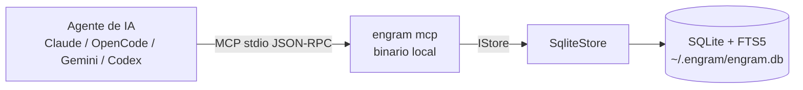
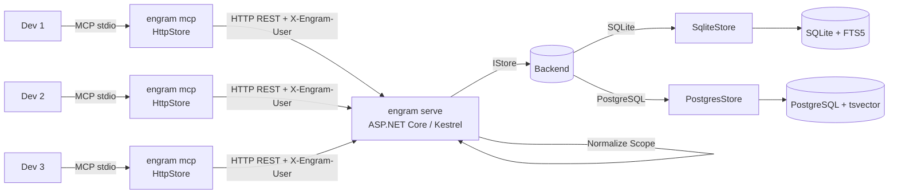
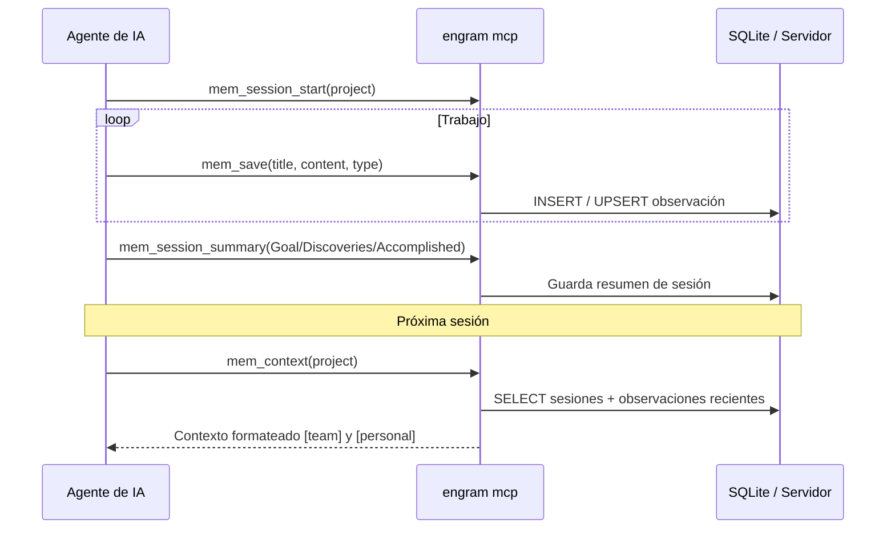
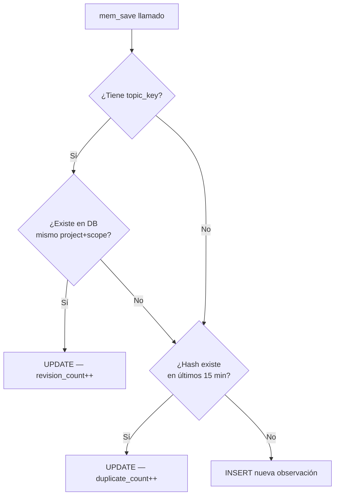
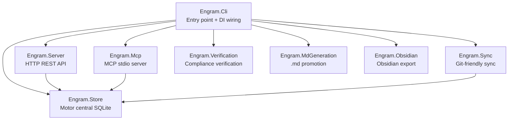

[← Volver al README](../README.md)

# Arquitectura — engram-dotnet

> Este documento describe la arquitectura técnica de **engram-dotnet**, un port en .NET 10 del proyecto original [engram](https://github.com/Gentleman-Programming/engram). El diseño conceptual (cómo funciona el sistema de memoria, el ciclo de sesiones, las herramientas MCP) proviene íntegramente del proyecto original.

---

## Índice

- [Cómo funciona](#cómo-funciona)
- [Modo equipo (servidor compartido)](#modo-equipo-servidor-compartido)
- [Ciclo de sesión](#ciclo-de-sesión)
- [Sistema de deduplicación](#sistema-de-deduplicación)
- [Estructura del proyecto](#estructura-del-proyecto)
- [Grafo de dependencias](#grafo-de-dependencias)
- [Stack técnico](#stack-técnico)
- [Decisiones arquitecturales](#decisiones-arquitecturales)
- [Schema de base de datos](#schema-de-base-de-datos)
- [Herramientas MCP](#herramientas-mcp)

---

## Cómo funciona

### Modo local (una instancia por desarrollador)



### Modo equipo (servidor compartido)



El binario `engram mcp` detecta la variable de entorno `ENGRAM_URL`. Si está presente, instancia `HttpStore` (proxy HTTP) en lugar de `SqliteStore` — sin ningún cambio en el código del agente ni en el protocolo MCP.

El servidor `engram serve` selecciona el backend local según `ENGRAM_DB_TYPE`:
- `sqlite` (default) → `SqliteStore` con SQLite + FTS5
- `postgres` → `PostgresStore` con PostgreSQL + tsvector

El agente decide qué vale la pena recordar y llama a `mem_save`. Engram persiste la observación con indexación FTS (FTS5 o tsvector según backend), deduplicación automática y soporte de `topic_key` para temas evolutivos.

```
1. El agente completa trabajo significativo (bugfix, decisión de arquitectura, etc.)
2. El agente llama mem_save con un resumen estructurado:
   - title: "Fixed N+1 query in user list"
   - type: "bugfix"
   - content: formato What/Why/Where/Learned
3. Engram persiste en SQLite con indexación FTS5
4. Siguiente sesión: el agente busca en memoria, obtiene contexto relevante
```

---

## Modo equipo (servidor compartido)

### Variables de entorno del cliente

| Variable | Descripción |
|---|---|
| `ENGRAM_URL` | URL del servidor centralizado. Si está presente, activa modo proxy. Ej: `http://10.0.0.5:7437` |
| `ENGRAM_USER` | Identidad del desarrollador. Namespcea las memorias como `user/project`. Ej: `victor.silgado` |

### Namespacing transparente

Cuando el agente guarda una memoria del proyecto `mi-api` con `ENGRAM_USER=victor.silgado`, el proyecto se convierte automáticamente en `victor.silgado/mi-api` antes de enviarlo al servidor. El agente no lo sabe ni necesita saberlo. Las búsquedas también filtran por usuario automáticamente.

```csharp
// McpConfig.ResolveNamespacedProject — en EngramTools.cs
string ResolveNamespacedProject(string? project)
    → string.IsNullOrWhiteSpace(User) ? project : $"{User}/{project}"
```

### HttpStore — proxy HTTP

`HttpStore` implementa `IStore` completo delegando cada llamada a un endpoint HTTP del servidor. Diferencias clave respecto a `SqliteStore`:

- **Sin SQLite local** — no hay archivo `.db` en la máquina del desarrollador
- **Header de identidad** — cada request incluye `X-Engram-User: {ENGRAM_USER}` para auditoría
- **Errores legibles** — las respuestas de error HTTP se envuelven en `EngramRemoteException` y llegan al agente como mensajes descriptivos
- **Idéntica interfaz** — el agente MCP no sabe si habla con `SqliteStore` o `HttpStore`

---

## Ciclo de sesión



---

## Sistema de deduplicación



### Camino 1 — topic_key upsert
Si la observación tiene `topic_key`, busca si ya existe una observación con ese mismo topic_key en el mismo proyecto+scope. Si existe, la **actualiza** en lugar de crear una nueva (incrementa `revision_count`).

```
¿Tiene topic_key? → SÍ → ¿Existe en DB? → SÍ → UPDATE (revision_count++)
                                          → NO → continúa al camino 2
```

Útil para conocimiento que evoluciona: la decisión de arquitectura de auth puede cambiar varias veces — siempre es la misma observación actualizada.

### Camino 2 — deduplicación por contenido (ventana 15 min)
Calcula `normalized_hash` del contenido (SHA-256 de contenido en minúsculas con espacios colapsados). Si el mismo hash existe en los últimos 15 minutos, incrementa `duplicate_count` en lugar de insertar.

```
¿hash existe en últimos 15 min? → SÍ → UPDATE (duplicate_count++)
                                 → NO → continúa al camino 3
```

Evita que un agente guarde la misma información repetidamente en una sesión.

### Camino 3 — INSERT nuevo
Si ninguno de los dos caminos anteriores aplica, inserta una nueva observación.

### Algoritmos de normalización

```csharp
// HashNormalized — debe ser idéntico al proyecto Go original
// Go: strings.ToLower(strings.Join(strings.Fields(content), " "))
// strings.Fields divide por CUALQUIER whitespace (\t, \n, \r, espacio)
string HashNormalized(string content)
    → lowercase + colapsar whitespace → SHA256 → hex lowercase

// NormalizeTopicKey
// Go: TrimSpace + ToLower + colapsar whitespace a "-" + truncar a 120 chars
string NormalizeTopicKey(string? topic)
    → trim + lowercase + espacios→guiones + máx 120 chars

// Ejemplo: "Auth Model" → "auth-model"
//          "architecture/auth model" → "architecture/auth-model"
```

---

## Estructura del proyecto

```
engram-dotnet/
├── src/
│   ├── Engram.Store/              ← Motor central: persistencia multi-backend
│   │   ├── IStore.cs              ← Interfaz pública (32 métodos async + 2 properties)
│   │   ├── SqliteStore.cs         ← Implementación SQLite (modo local)
│   │   ├── PostgresStore.cs       ← Implementación PostgreSQL (modo equipo escalable)
│   │   ├── HttpStore.cs           ← Implementación HTTP proxy (modo equipo remoto)
│   │   ├── Models.cs              ← Session, Observation, Prompt, Stats, etc.
│   │   ├── StoreConfig.cs         ← Configuración desde variables de entorno
│   │   ├── Normalizers.cs         ← HashNormalized, NormalizeTopicKey, SanitizeFts5Query
│   │   └── PassiveCapture.cs      ← Extracción de aprendizajes de texto libre
│   ├── Engram.Server/             ← HTTP REST API (ASP.NET Core Minimal API)
│   │   └── EngramServer.cs        ← 30 endpoints (rutas + middleware integrados)
│   ├── Engram.Mcp/                ← Servidor MCP (transporte stdio)
│   │   ├── EngramMcpServer.cs     ← Bootstrap y configuración del servidor MCP
│   │   └── EngramTools.cs         ← 19 herramientas + McpConfig (ENGRAM_USER)
│   ├── Engram.Sync/               ← Sync git-friendly (gzip + JSONL)
│   │   └── EngramSync.cs          ← Export/import de chunks comprimidos
│   ├── Engram.Verification/       ← Verificación de compliance contra spec.md
│   │   ├── SpecParser.cs          ← Parser de spec.md canónico (RF/RNF)
│   │   ├── ArtifactVerifier.cs    ← LLM-as-Judge para verificar código
│   │   ├── TraceabilityMatrix.cs  ← Matriz RF/RNF → código
│   │   ├── CycleTracker.cs        ← Trackeo de ciclos de rework
│   │   └── Models.cs              ← VerificationReport, ReworkTicket, Verdict
│   ├── Engram.MdGeneration/       ← Promoción de observaciones a .md
│   │   ├── PromotionService.cs    ← Servicio de promoción batch/individual
│   │   ├── MdTemplateEngine.cs    ← Generación de .md con frontmatter
│   │   ├── MdSlug.cs              ← Slug generation para filenames
│   │   ├── MdIndexGenerator.cs    ← Generación de índice de decisiones
│   │   └── LinkVerifier.cs        ← Verificación de links bidireccionales
│   ├── Engram.Obsidian/           ← Export a vault de Obsidian
│   │   ├── Exporter.cs            ← Motor de export (incremental/full)
│   │   ├── MarkdownRenderer.cs    ← Conversión observation → markdown
│   │   ├── HubGenerator.cs        ← Session hubs + topic hubs
│   │   ├── Slug.cs                ← Filename slugification
│   │   ├── SyncState.cs           ← Estado para export incremental
│   │   └── GraphConfig.cs         ← Obsidian graph.json config
│   └── Engram.Cli/                ← Entry point CLI + wiring DI
│       └── Program.cs             ← Comandos: serve, mcp, search, promote, projects, obsidian-export, etc.
│                                     Switch automático: ENGRAM_URL → HttpStore | ENGRAM_DB_TYPE → PostgresStore | SqliteStore
├── tests/
│   ├── Engram.Store.Tests/        ← Unitarios + integración (99 tests en 4 files)
│   ├── Engram.Postgres.Tests/     ← Paridad con Testcontainers (32 tests)
│   ├── Engram.Server.Tests/       ← HTTP con WebApplicationFactory (27 tests)
│   ├── Engram.Mcp.Tests/          ← Herramientas MCP + McpConfig (52 tests)
│   ├── Engram.HttpStore.Tests/    ← HttpStore end-to-end (30 tests)
│   ├── Engram.Obsidian.Tests/     ← Export, hubs, slug, graph (47 tests)
│   ├── Engram.Verification.Tests/ ← Spec parser, verifier, traceability (28 tests)
│   └── Engram.MdGeneration.Tests/ ← Templates, slugs, promotion (17 tests)

**Total**: 332 tests (322 Facts + 10 Theories) en 28 archivos.
└── config/
    ├── cursor/
    │   ├── mcp.json               ← Config MCP para Cursor
    │   ├── rules/
    │   │   ├── engram.mdc         ← Reglas de memoria (alwaysApply: true)
    │   │   └── sdd-orchestrator.md← Orquestador SDD
    │   └── agents/                ← 9 sub-agentes SDD (sdd-apply, sdd-design, etc.)
    └── vscode/
        ├── mcp.json               ← Config MCP para VS Code
        └── prompts/
            └── engram.instructions.md ← Instrucciones de memoria para GitHub Copilot
```

---

## Grafo de dependencias



`Engram.Store` no tiene dependencias de proyecto — solo NuGet. Es el único módulo que toca la base de datos.

---

## Stack técnico

| Capa | Tecnología |
|---|---|
| Lenguaje | C# / .NET 10 LTS |
| HTTP | ASP.NET Core Minimal API (Kestrel) |
| Base de datos | SQLite via `Microsoft.Data.Sqlite` + FTS5 **o** PostgreSQL via `Npgsql` + tsvector |
| MCP | `ModelContextProtocol` NuGet (Microsoft oficial) |
| CLI | `System.CommandLine` |
| Auth | `Microsoft.AspNetCore.Authentication.JwtBearer` (opcional) |
| Tests | xUnit + WebApplicationFactory + Testcontainers.PostgreSql |
| Deploy | Self-contained linux-x64 (binario único, sin runtime externo) |

---

## Decisiones arquitecturales

### Self-Contained vs Native AOT
Se eligió **Self-Contained** (no Native AOT) porque:
- Native AOT requiere trimming y prohíbe `Assembly.LoadFile` y `Reflection.Emit`
- El SDK oficial de MCP usa reflection internamente
- Self-Contained produce un binario único que no requiere .NET instalado en el servidor, con cero restricciones de código

```bash
dotnet publish src/Engram.Cli -c Release -r linux-x64 --self-contained -o dist/
```

### Engram.Server como librería (no ejecutable)
`Engram.Server` usa `Microsoft.NET.Sdk` (no `Sdk.Web`) con `OutputType=Library`. El entry point es siempre `Engram.Cli`. Esto permite que el CLI arranque el servidor Kestrel embebido sin depender de un ejecutable separado.

### SQL directo (sin ORM)
El schema de SQLite debe ser **idéntico** al proyecto Go original para garantizar compatibilidad de datos en la migración. Un ORM introduciría abstracción sobre el schema que haría difícil mantener esta paridad. Toda la SQL vive en `SqliteStore.cs` como constantes `string`.

### JWT opcional
Si `ENGRAM_JWT_SECRET` no está configurado, el servidor arranca sin autenticación (comportamiento idéntico al proyecto Go original). Si está configurado, todos los endpoints excepto `/health` requieren `Authorization: Bearer <token>`.

### HttpStore y IStore — Strategy Pattern

El switch entre modo local y modo equipo se resuelve via `IStore`:

```csharp
// Program.cs — comando mcp
IStore store = config.IsRemote
    ? new HttpStore(config)
    : config.IsPostgres
        ? new PostgresStore(config)
        : new SqliteStore(config);
```

`HttpStore` y `PostgresStore` implementan exactamente la misma interfaz que `SqliteStore`. El servidor MCP y las herramientas no saben con qué implementación están trabajando. Este es el **Strategy Pattern**: la estrategia de persistencia se inyecta, no se hardcodea.

| Implementación | Backend | FTS | Uso |
|---|---|---|---|
| `SqliteStore` | SQLite + FTS5 | FTS5 virtual table | Local, 1-4 devs |
| `PostgresStore` | PostgreSQL 15+ | tsvector + GIN index | Equipo, 5+ devs |
| `HttpStore` | HTTP proxy | Delega al servidor | Modo remoto |

Las únicas diferencias visibles desde el exterior:
- `SqliteStore` lee/escribe un archivo `.db` local
- `PostgresStore` conecta a PostgreSQL con schema auto-creado
- `HttpStore` hace requests HTTP al servidor centralizado con header `X-Engram-User`

### Aislamiento Multi-Usuario (X-Engram-User)

El servidor implementa aislamiento de memoria personal mediante el header de identidad `X-Engram-User`.

#### Identidad del desarrollador
El cliente MCP (`HttpStore`) envía automáticamente la identidad del usuario:
1.  Usa el valor de la variable de entorno `ENGRAM_USER`.
2.  Si no está definida, usa el usuario del sistema operativo (`Environment.UserName`).

#### Aislamiento de Scope en el Servidor
Cuando el servidor recibe una petición, normaliza el `scope` de la observación o búsqueda:

- **`team`**: Se mantiene compartido para todos los usuarios.
- **`personal`**: Se transforma internamente a `personal:{userId}`.

Esto garantiza que las memorias personales de `usuario-a` no sean visibles para `usuario-b`, incluso si están trabajando en el mismo proyecto, mientras que las decisiones de arquitectura (`team`) siguen siendo compartidas.

```csharp
// EngramServer.NormalizeScope logic
string NormalizeScope(string? scope, string user) =>
    scope == "team" ? "team" : $"personal:{user}";
```

#### Compatibilidad Legacy
Si el header `X-Engram-User` no está presente, el servidor usa la identidad `global`. Las instalaciones locales de una sola instancia siguen funcionando sin cambios, ya que todas operan bajo el usuario por defecto.

---

## Módulos especializados

### Engram.Verification — Compliance verification

Módulo de verificación de código contra especificaciones. Permite validar que los cambios implementados satisfacen los requisitos funcionales y no-funcionales de un `spec.md`.

**Casos de uso**:
- Verificar que un PR cumple con todos los RF/RNF de un spec
- Generar matriz de trazabilidad RF/RNF → código
- Detectar requisitos no implementados antes de merge
- Trackear ciclos de rework por cambio

**Componentes**:
- `SpecParser.cs` — Parsea `spec.md` canónico y extrae lista de RF/RNF
- `ArtifactVerifier.cs` — Llama a LLM (Anthropic API) para juzgar si el código cumple cada requisito
- `TraceabilityMatrix.cs` — Genera matriz RF/RNF → file paths
- `CycleTracker.cs` — Trackea ciclos de rework por cambio (persiste en Engram store)
- `Models.cs` — `VerificationReport`, `ReworkTicket`, `Verdict`, `TraceabilityEntry`

**MCP tools**:
- `mem_verify_artifact` — Verifica código contra spec.md, retorna reporte estructurado
- `mem_traceability` — Genera matriz de trazabilidad RF/RNF

**Configuración**:
```bash
ENGRAM_VERIFICATION_MODEL=claude-sonnet-4-20250514  # Modelo para LLM-as-Judge
ENGRAM_VERIFICATION_MAX_CYCLES=3                     # Máximos ciclos antes de escalar
ANTHROPIC_API_KEY=sk-...                             # API key (requerida)
```

---

### Engram.MdGeneration — Promoción de observaciones a .md

Módulo de generación de archivos Markdown versionables a partir de observaciones. Permite promover decisiones importantes de la DB a archivos `.md` en el repositorio del proyecto.

**Casos de uso**:
- Promover `type=architecture` o `type=decision` a ADRs versionables
- Generar índice de decisiones en `docs/decisions/index.md`
- Sincronizar batch de observaciones sin .md
- Crear link bidireccional: observation ↔ .md file

**Componentes**:
- `PromotionService.cs` — Servicio de promoción individual/batch
- `MdTemplateEngine.cs` — Genera .md con frontmatter canónico (id, type, title, dates, topic_key)
- `MdSlug.cs` — Genera slug filesystem-safe para filenames
- `MdIndexGenerator.cs` — Genera/actualiza índice de decisiones
- `LinkVerifier.cs` — Verifica links bidireccionales (observation.md_path ↔ .md frontmatter)

**MCP tools**:
- `mem_promote_to_md` — Promueve observación individual a .md
- `mem_sync_md_to_repo` — Sincroniza batch de observaciones sin .md

**CLI**:
```bash
engram promote --id 42 --md-dir docs/decisions/
engram promote --sync --dry-run  # Muestra qué se promovería
```

**Configuración**:
```bash
ENGRAM_MD_DIR=docs/decisions/  # Directorio destino (default: docs/decisions/)
```

---

### Engram.Obsidian — Export a vault de Obsidian

Módulo de export de observaciones a un vault de Obsidian como archivos `.md` estructurados.

**Casos de uso**:
- Exportar todas las observaciones de un proyecto a Obsidian
- Generar session hubs (`_sessions/{id}.md`) y topic hubs (`_topics/{prefix}.md`)
- Export incremental (solo observaciones nuevas desde último export)
- Configurar Obsidian graph view para visualización de conexiones

**Componentes**:
- `Exporter.cs` — Motor de export (full/incremental)
- `MarkdownRenderer.cs` — Conversión observation → markdown con YAML frontmatter + wikilinks
- `HubGenerator.cs` — Genera session hubs y topic hubs (threshold ≥2)
- `Slug.cs` — Filename slugification (lowercase, max 60 chars, append ID si colisión)
- `SyncState.cs` — Estado para export incremental (`.engram-sync-state.json`)
- `GraphConfig.cs` — Gestión de `.obsidian/graph.json` (preserve/force/skip)

**CLI**:
```bash
engram obsidian-export --vault /path/to/vault --project my-api --graph-config preserve
engram obsidian-export --force  # Re-export completo (ignora estado incremental)
```

**Estructura del vault**:
```
{vault}/
  engram/
    _sessions/{sessionId}.md      ← Session hub notes
    _topics/{prefix}.md           ← Topic cluster hub notes
    {project}/{type}/{slug}.md    ← Observation files
    .engram-sync-state.json       ← Incremental state
  .obsidian/
    graph.json                    ← Graph config (opcional)
```

---

## Schema de base de datos

El schema es **idéntico** al proyecto Go original para permitir migración directa de datos.

### SQLite (SqliteStore)

Tablas principales:
- `sessions` — sesiones de trabajo de agentes
- `observations` — memorias persistidas (con `normalized_hash`, `topic_key`, `revision_count`, `duplicate_count`)
- `user_prompts` — prompts del usuario
- `sync_chunks` — registro de chunks sincronizados (idempotencia)
- `sync_mutations` — cola de mutaciones pendientes de sync
- `sync_state` / `sync_enrolled_projects` — estado del sync
- `sync_apply_deferred` — FK misses de mutaciones pull (Phase 1, nuevo)

Tabla FTS5:
- `observations_fts` — índice full-text (title, content, tool_name, type, project, topic_key)

PRAGMAs aplicados al abrir la conexión:
```sql
PRAGMA journal_mode=WAL;
PRAGMA busy_timeout=5000;
PRAGMA synchronous=NORMAL;
PRAGMA foreign_keys=ON;
```

### PostgreSQL (PostgresStore)

Mismas tablas que SQLite, con diferencias en el FTS:

- **Full-Text Search**: `search_vector tsvector GENERATED ALWAYS AS STORED` en la tabla `observations`
- **Índices GIN**: `idx_obs_fts` y `idx_obs_fts_active WHERE deleted_at IS NULL`
- **Fechas**: `TEXT` (ISO-8601) en v1, con casts explícitos `created_at::timestamptz` para queries de tiempo
- **Auto-increment**: `BIGSERIAL` en lugar de `INTEGER AUTOINCREMENT`
- **Default timestamps**: `NOW() AT TIME ZONE 'utc'` en lugar de `datetime('now')`

Ver [docs/POSTGRES-SETUP.md](POSTGRES-SETUP.md) para detalles de configuración y migración.

---

## Offline-First Sync

> **Feature Index**: [`docs/OFFLINE-FIRST-SYNC.md`](OFFLINE-FIRST-SYNC.md)
> **SDD**: [`sdd/offline-first-sync/`](sdd/offline-first-sync/)
> **Phase**: Planned (PR #14 pending)
> **Effort**: 32–44h across 4 phases

Bidirectional mutation-based sync between local SQLite and cloud PostgreSQL server.
Full architecture in SDD design document.

### Components

```
Engram.Sync/
├── Transport/
│   ├── IMutationTransport.cs         ← HTTP client interface
│   ├── MutationTransport.cs          ← IHttpClientFactory impl
│   └── MutationTransportException.cs ← Error with status code
├── SyncManager.cs                    ← BackgroundService (IHostedService)
├── SyncManagerConfig.cs              ← Config (debounce, batch sizes, backoff)
├── SyncPhase.cs                      ← Enum: Idle/Pushing/Pulling/etc
└── ILocalSyncStore.cs               ← Store interface subset

Engram.Server/
├── CloudSyncEndpoints.cs            ← /sync/mutations/push + /sync/mutations/pull
└── Dtos/MutationDtos.cs             ← PushRequest, PullResponse DTOs

Engram.Store/
├── ICloudMutationStore.cs           ← Server-side cloud store interface
├── PostgresStore.cs                 ← + cloud_mutations, cloud_sync_audit_log, cloud_project_controls
└── SqliteStore.cs                   ← + sync_apply_deferred, ILocalSyncStore impl
```

### New Tables (Phase 1)

| Table | Backend | Purpose |
|-------|---------|---------|
| `cloud_mutations` | PostgreSQL | Server-side append-only mutation journal |
| `cloud_sync_audit_log` | PostgreSQL | Audit trail for push rejections |
| `cloud_project_controls` | PostgreSQL | Per-project `sync_enabled` + pause reason |
| `sync_apply_deferred` | SQLite | FK misses from pulled mutations (retry before next pull) |

### API Endpoints

| Route | Method | Phase |
|-------|--------|-------|
| `/sync/mutations/push` | POST | 1 |
| `/sync/mutations/pull` | GET | 1 |
| `/sync/enroll` | POST | 3 |
| `/sync/pause` | POST | 3 |
| `/sync/status` | GET | 4 |

### Sync Flow

```
Online (server source of truth):
  SyncManager → PushMutationsAsync → POST /sync/mutations/push
             → AckSeqs → PullMutationsAsync → GET /sync/mutations/pull
             → ApplyPulledMutation → ReplayDeferred

Offline (local source of truth):
  Local writes → EnqueueSyncMutation → sync_mutations queue
  On reconnect → SyncManager drains queue → PushMutationsAsync
```

### Conflict Resolution

**Last-write-wins** via `occurred_at` timestamp ordering.
**FK misses** → `sync_apply_deferred` table → `ReplayDeferredAsync` before next pull cycle.
Cursor **NEVER halts** on FK miss.

---

## Herramientas MCP

Las mismas 15 herramientas del proyecto original, organizadas en perfiles:

**Perfil `agent`** (por defecto — herramientas para agentes de IA):

| Herramienta | Propósito |
|---|---|
| `mem_save` | Guardar observación estructurada |
| `mem_update` | Actualizar por ID |
| `mem_suggest_topic_key` | Sugerir clave estable para temas evolutivos |
| `mem_search` | Búsqueda full-text (resultados truncados a 300 chars con `[preview]`) |
| `mem_session_summary` | Resumen de fin de sesión |
| `mem_context` | Contexto reciente de sesiones anteriores |
| `mem_timeline` | Contexto cronológico alrededor de una observación |
| `mem_get_observation` | Contenido completo por ID (sin truncar) |
| `mem_save_prompt` | Guardar prompt del usuario |
| `mem_capture_passive` | Extraer aprendizajes de texto |
| `mem_session_start` | Registrar inicio de sesión |

**Perfil `admin`** (herramientas de administración):

| Herramienta | Propósito |
|---|---|
| `mem_delete` | Borrar observación (soft-delete por defecto) |
| `mem_stats` | Estadísticas del sistema |
| `mem_timeline` | Contexto cronológico |
| `mem_merge_projects` | Consolidar variantes de nombre de proyecto |

Selección de perfil: `engram mcp --tools=agent` (default) | `--tools=admin` | `--tools=all`
