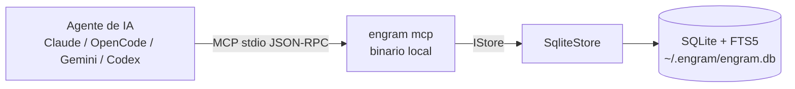
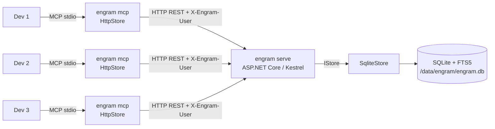
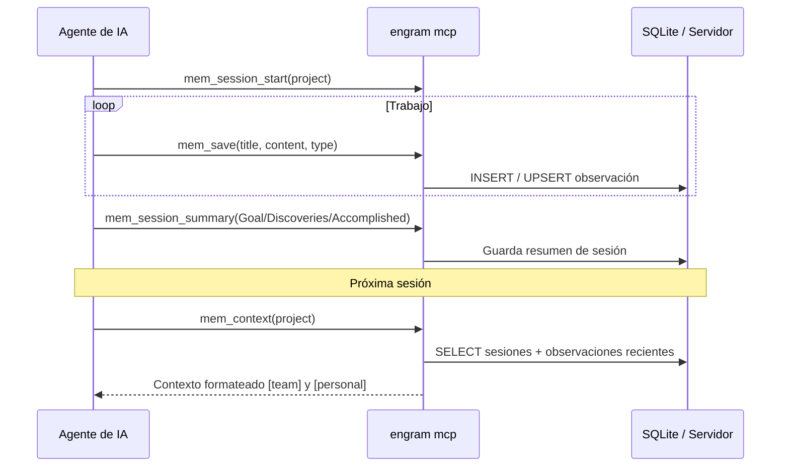
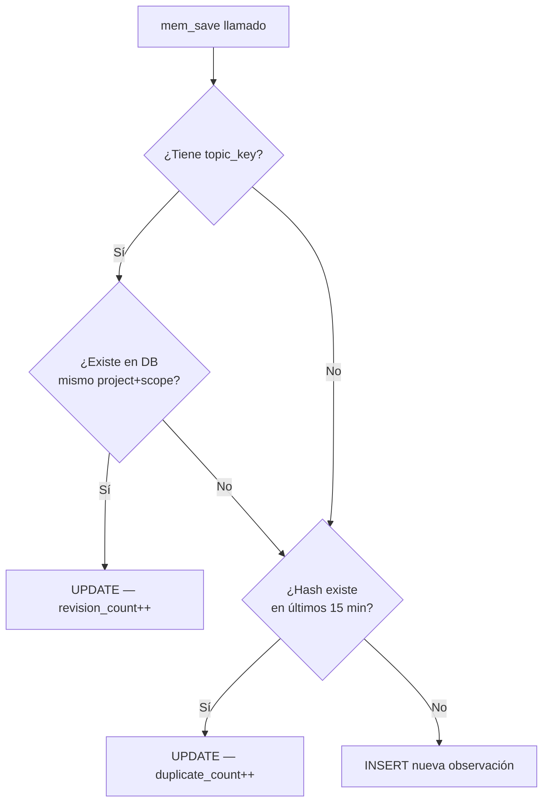
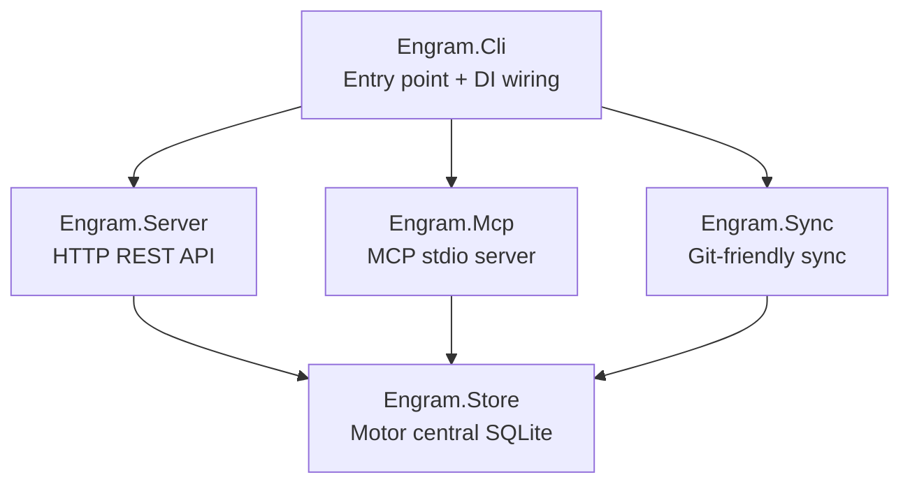

[← Volver al README](../README.md)

# Arquitectura — engram-dotnet

> Este documento describe la arquitectura técnica de **engram-dotnet**, un port en .NET 10 del proyecto original [engram](https://github.com/Gentleman-Programming/engram). El diseño conceptual (cómo funciona el sistema de memoria, el ciclo de sesiones, las herramientas MCP) proviene íntegramente del proyecto original.

---

## Índice

- [Cómo funciona](#cómo-funciona)
- [Modo equipo (servidor compartido)](#modo-equipo-servidor-compartido)
- [Ciclo de sesión](#ciclo-de-sesión)
- [Sistema de deduplicación](#sistema-de-deduplicación)
- [Estructura del proyecto](#estructura-del-proyecto)
- [Grafo de dependencias](#grafo-de-dependencias)
- [Stack técnico](#stack-técnico)
- [Decisiones arquitecturales](#decisiones-arquitecturales)
- [Schema de base de datos](#schema-de-base-de-datos)
- [Herramientas MCP](#herramientas-mcp)

---

## Cómo funciona

### Modo local (una instancia por desarrollador)



### Modo equipo (servidor compartido)



El binario `engram mcp` detecta la variable de entorno `ENGRAM_URL`. Si está presente, instancia `HttpStore` (proxy HTTP) en lugar de `SqliteStore` — sin ningún cambio en el código del agente ni en el protocolo MCP.

El agente decide qué vale la pena recordar y llama a `mem_save`. Engram persiste la observación con indexación FTS5, deduplicación automática y soporte de `topic_key` para temas evolutivos.

```
1. El agente completa trabajo significativo (bugfix, decisión de arquitectura, etc.)
2. El agente llama mem_save con un resumen estructurado:
   - title: "Fixed N+1 query in user list"
   - type: "bugfix"
   - content: formato What/Why/Where/Learned
3. Engram persiste en SQLite con indexación FTS5
4. Siguiente sesión: el agente busca en memoria, obtiene contexto relevante
```

---

## Modo equipo (servidor compartido)

### Variables de entorno del cliente

| Variable | Descripción |
|---|---|
| `ENGRAM_URL` | URL del servidor centralizado. Si está presente, activa modo proxy. Ej: `http://10.0.0.5:7437` |
| `ENGRAM_USER` | Identidad del desarrollador. Namespcea las memorias como `user/project`. Ej: `victor.silgado` |

### Namespacing transparente

Cuando el agente guarda una memoria del proyecto `mi-api` con `ENGRAM_USER=victor.silgado`, el proyecto se convierte automáticamente en `victor.silgado/mi-api` antes de enviarlo al servidor. El agente no lo sabe ni necesita saberlo. Las búsquedas también filtran por usuario automáticamente.

```csharp
// McpConfig.ResolveNamespacedProject — en EngramTools.cs
string ResolveNamespacedProject(string? project)
    → string.IsNullOrWhiteSpace(User) ? project : $"{User}/{project}"
```

### HttpStore — proxy HTTP

`HttpStore` implementa `IStore` completo delegando cada llamada a un endpoint HTTP del servidor. Diferencias clave respecto a `SqliteStore`:

- **Sin SQLite local** — no hay archivo `.db` en la máquina del desarrollador
- **Header de identidad** — cada request incluye `X-Engram-User: {ENGRAM_USER}` para auditoría
- **Errores legibles** — las respuestas de error HTTP se envuelven en `EngramRemoteException` y llegan al agente como mensajes descriptivos
- **Idéntica interfaz** — el agente MCP no sabe si habla con `SqliteStore` o `HttpStore`

---

## Ciclo de sesión



---

## Sistema de deduplicación



### Camino 1 — topic_key upsert
Si la observación tiene `topic_key`, busca si ya existe una observación con ese mismo topic_key en el mismo proyecto+scope. Si existe, la **actualiza** en lugar de crear una nueva (incrementa `revision_count`).

```
¿Tiene topic_key? → SÍ → ¿Existe en DB? → SÍ → UPDATE (revision_count++)
                                          → NO → continúa al camino 2
```

Útil para conocimiento que evoluciona: la decisión de arquitectura de auth puede cambiar varias veces — siempre es la misma observación actualizada.

### Camino 2 — deduplicación por contenido (ventana 15 min)
Calcula `normalized_hash` del contenido (SHA-256 de contenido en minúsculas con espacios colapsados). Si el mismo hash existe en los últimos 15 minutos, incrementa `duplicate_count` en lugar de insertar.

```
¿hash existe en últimos 15 min? → SÍ → UPDATE (duplicate_count++)
                                 → NO → continúa al camino 3
```

Evita que un agente guarde la misma información repetidamente en una sesión.

### Camino 3 — INSERT nuevo
Si ninguno de los dos caminos anteriores aplica, inserta una nueva observación.

### Algoritmos de normalización

```csharp
// HashNormalized — debe ser idéntico al proyecto Go original
// Go: strings.ToLower(strings.Join(strings.Fields(content), " "))
// strings.Fields divide por CUALQUIER whitespace (\t, \n, \r, espacio)
string HashNormalized(string content)
    → lowercase + colapsar whitespace → SHA256 → hex lowercase

// NormalizeTopicKey
// Go: TrimSpace + ToLower + colapsar whitespace a "-" + truncar a 120 chars
string NormalizeTopicKey(string? topic)
    → trim + lowercase + espacios→guiones + máx 120 chars

// Ejemplo: "Auth Model" → "auth-model"
//          "architecture/auth model" → "architecture/auth-model"
```

---

## Estructura del proyecto

```
engram-dotnet/
├── src/
│   ├── Engram.Store/              ← Motor central: SQLite + FTS5 + deduplicación
│   │   ├── IStore.cs              ← Interfaz pública (22 métodos)
│   │   ├── SqliteStore.cs         ← Implementación SQLite (modo local)
│   │   ├── HttpStore.cs           ← Implementación HTTP proxy (modo equipo)
│   │   ├── Models.cs              ← Session, Observation, Prompt, Stats, etc.
│   │   ├── StoreConfig.cs         ← Configuración desde variables de entorno
│   │   ├── Normalizers.cs         ← HashNormalized, NormalizeTopicKey, SanitizeFts5Query
│   │   └── PassiveCapture.cs      ← Extracción de aprendizajes de texto libre
│   ├── Engram.Server/             ← HTTP REST API (ASP.NET Core Minimal API)
│   │   └── EngramServer.cs        ← 22 endpoints (rutas + middleware integrados)
│   ├── Engram.Mcp/                ← Servidor MCP (transporte stdio)
│   │   ├── EngramMcpServer.cs     ← Bootstrap y configuración del servidor MCP
│   │   └── EngramTools.cs         ← 15 herramientas registradas + McpConfig (ENGRAM_USER)
│   ├── Engram.Sync/               ← Sync git-friendly (gzip + JSONL)
│   │   └── EngramSync.cs          ← Export/import de chunks comprimidos
│   └── Engram.Cli/                ← Entry point CLI + wiring DI
│       └── Program.cs             ← Comandos serve, mcp, search, export, import, etc.
│                                     Switch automático: ENGRAM_URL → HttpStore | SqliteStore
├── tests/
│   ├── Engram.Store.Tests/        ← Unitarios + integración + tests de paridad (51)
│   ├── Engram.Server.Tests/       ← Tests HTTP con WebApplicationFactory (16)
│   ├── Engram.Mcp.Tests/          ← Tests de herramientas MCP + McpConfig (32)
│   └── Engram.HttpStore.Tests/    ← Tests end-to-end de HttpStore con servidor real (25)
└── config/
    ├── cursor/
    │   ├── mcp.json               ← Config MCP para Cursor
    │   ├── rules/
    │   │   ├── engram.mdc         ← Reglas de memoria (alwaysApply: true)
    │   │   └── sdd-orchestrator.md← Orquestador SDD
    │   └── agents/                ← 9 sub-agentes SDD (sdd-apply, sdd-design, etc.)
    └── vscode/
        ├── mcp.json               ← Config MCP para VS Code
        └── prompts/
            └── engram.instructions.md ← Instrucciones de memoria para GitHub Copilot
```

---

## Grafo de dependencias



`Engram.Store` no tiene dependencias de proyecto — solo NuGet. Es el único módulo que toca la base de datos.

---

## Stack técnico

| Capa | Tecnología |
|---|---|
| Lenguaje | C# / .NET 10 LTS |
| HTTP | ASP.NET Core Minimal API (Kestrel) |
| Base de datos | SQLite via `Microsoft.Data.Sqlite` + FTS5 |
| MCP | `ModelContextProtocol` NuGet (Microsoft oficial) |
| CLI | `System.CommandLine` |
| Auth | `Microsoft.AspNetCore.Authentication.JwtBearer` (opcional) |
| Tests | xUnit + WebApplicationFactory + tests de paridad |
| Deploy | Self-contained linux-x64 (binario único, sin runtime externo) |

---

## Decisiones arquitecturales

### Self-Contained vs Native AOT
Se eligió **Self-Contained** (no Native AOT) porque:
- Native AOT requiere trimming y prohíbe `Assembly.LoadFile` y `Reflection.Emit`
- El SDK oficial de MCP usa reflection internamente
- Self-Contained produce un binario único que no requiere .NET instalado en el servidor, con cero restricciones de código

```bash
dotnet publish src/Engram.Cli -c Release -r linux-x64 --self-contained -o dist/
```

### Engram.Server como librería (no ejecutable)
`Engram.Server` usa `Microsoft.NET.Sdk` (no `Sdk.Web`) con `OutputType=Library`. El entry point es siempre `Engram.Cli`. Esto permite que el CLI arranque el servidor Kestrel embebido sin depender de un ejecutable separado.

### SQL directo (sin ORM)
El schema de SQLite debe ser **idéntico** al proyecto Go original para garantizar compatibilidad de datos en la migración. Un ORM introduciría abstracción sobre el schema que haría difícil mantener esta paridad. Toda la SQL vive en `SqliteStore.cs` como constantes `string`.

### JWT opcional
Si `ENGRAM_JWT_SECRET` no está configurado, el servidor arranca sin autenticación (comportamiento idéntico al proyecto Go original). Si está configurado, todos los endpoints excepto `/health` requieren `Authorization: Bearer <token>`.

### HttpStore y IStore — Strategy Pattern

El switch entre modo local y modo equipo se resuelve via `IStore`:

```csharp
// Program.cs — comando mcp
IStore store = config.IsRemote
    ? new HttpStore(config)
    : new SqliteStore(config);
```

`HttpStore` implementa exactamente la misma interfaz que `SqliteStore`. El servidor MCP y las herramientas no saben con qué implementación están trabajando. Este es el **Strategy Pattern**: la estrategia de persistencia se inyecta, no se hardcodea.

Las únicas diferencias visibles desde el exterior:
- `SqliteStore` lee/escribe un archivo `.db` local
- `HttpStore` hace requests HTTP al servidor centralizado con header `X-Engram-User`

### Namespacing automático con ENGRAM_USER — Modelo team/personal

`McpConfig` resuelve el proyecto namespaceado antes de cada llamada a `IStore`. El modelo tiene **dos niveles de scope**:

| Scope | Namespace en DB | Visibilidad |
|---|---|---|
| `team` | `team/{project}` | Compartido con todos los desarrolladores del equipo |
| `personal` | `{user}/{project}` | Privado del desarrollador (ENGRAM_USER) |

```csharp
// Agente llama: mem_save(project: "mi-api", type: "architecture")
// AutoClassifyScope("architecture") → "team"
// McpConfig.ResolveNamespacedProject("mi-api", "team") → "team/mi-api"
// IStore recibe: project = "team/mi-api"

// Agente llama: mem_save(project: "mi-api", type: "tool_use")
// AutoClassifyScope("tool_use") → "personal"
// McpConfig.ResolveNamespacedProject("mi-api", "personal") → "victor.silgado/mi-api"
// IStore recibe: project = "victor.silgado/mi-api"
```

#### Auto-clasificación de scope por tipo

Cuando el agente no especifica `scope`, `AutoClassifyScope(type)` lo decide:

| Default: `team` | Default: `personal` |
|---|---|
| `architecture`, `decision`, `bugfix` | `tool_use`, `file_change` |
| `pattern`, `session_summary`, `config` | `command`, `file_read` |
| `discovery`, `learning`, `manual` | `search`, `passive` |

#### Wide-read en mem_context y mem_search

- `mem_context` siempre lee **ambos** namespaces (`team/` y `{user}/`) y mergea por `updated_at DESC`, etiquetando cada observación `[team]` o `[personal]`.
- `mem_search` sin `scope` explícito busca en ambos namespaces simultáneamente.
- `mem_search` con `scope` explícito filtra solo ese namespace.

#### Compatibilidad retroactiva

El valor legacy `scope="project"` en registros existentes se normaliza a `"personal"` vía `NormalizeScope()` en runtime. No se requiere migración masiva de datos.

```csharp
// SqliteStore.NormalizeScope
"team"     → "team"
"personal" → "personal"
"project"  → "personal"   // legacy
null/""    → "personal"   // default
```

El agente nunca necesita conocer su usuario ni el prefijo — el namespacing es completamente transparente.

---

## Schema de base de datos

El schema es **idéntico** al proyecto Go original para permitir migración directa de datos.

Tablas principales:
- `sessions` — sesiones de trabajo de agentes
- `observations` — memorias persistidas (con `normalized_hash`, `topic_key`, `revision_count`, `duplicate_count`)
- `user_prompts` — prompts del usuario
- `sync_chunks` — registro de chunks sincronizados (idempotencia)
- `sync_mutations` — cola de mutaciones pendientes de sync
- `sync_state` / `sync_enrolled_projects` — estado del sync

Tabla FTS5:
- `observations_fts` — índice full-text (title, content, tool_name, type, project, topic_key)

PRAGMAs aplicados al abrir la conexión:
```sql
PRAGMA journal_mode=WAL;
PRAGMA busy_timeout=5000;
PRAGMA synchronous=NORMAL;
PRAGMA foreign_keys=ON;
```

---

## Herramientas MCP

Las mismas 15 herramientas del proyecto original, organizadas en perfiles:

**Perfil `agent`** (por defecto — herramientas para agentes de IA):

| Herramienta | Propósito |
|---|---|
| `mem_save` | Guardar observación estructurada |
| `mem_update` | Actualizar por ID |
| `mem_suggest_topic_key` | Sugerir clave estable para temas evolutivos |
| `mem_search` | Búsqueda full-text (resultados truncados a 300 chars con `[preview]`) |
| `mem_session_summary` | Resumen de fin de sesión |
| `mem_context` | Contexto reciente de sesiones anteriores |
| `mem_timeline` | Contexto cronológico alrededor de una observación |
| `mem_get_observation` | Contenido completo por ID (sin truncar) |
| `mem_save_prompt` | Guardar prompt del usuario |
| `mem_capture_passive` | Extraer aprendizajes de texto |
| `mem_session_start` | Registrar inicio de sesión |

**Perfil `admin`** (herramientas de administración):

| Herramienta | Propósito |
|---|---|
| `mem_delete` | Borrar observación (soft-delete por defecto) |
| `mem_stats` | Estadísticas del sistema |
| `mem_timeline` | Contexto cronológico |
| `mem_merge_projects` | Consolidar variantes de nombre de proyecto |

Selección de perfil: `engram mcp --tools=agent` (default) | `--tools=admin` | `--tools=all`
