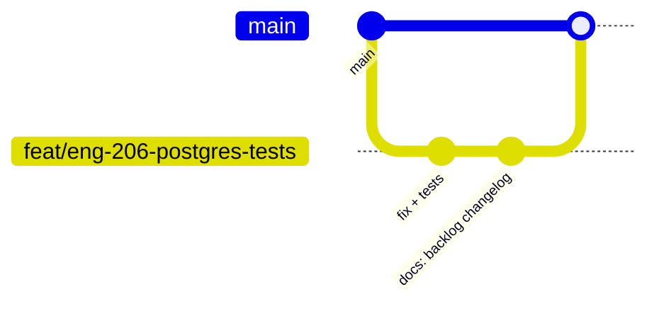

# Flujo Git — engram-dotnet (código abierto)

> Cómo trabajar con ramas, commits, PRs y releases en este repo.  
> Complementa [BACKLOG.md](BACKLOG.md) (qué hacer) y [engram-docs-on-done](../.cursor/skills/engram-docs-on-done/SKILL.md) (documentar al cerrar).

**Automatización en Cursor (solo este repo):** edita `config/cursor/rules/engram-git-workflow.mdc`, ejecuta `scripts/sync-cursor-rules.ps1` (o `.sh`) y Cursor cargará la copia en `.cursor/rules/`. No uses reglas globales de usuario para esto. Esta página sigue siendo la guía ampliada para humanos.

---

## Ramas

| Rama | Uso |
|------|-----|
| **`main`** | Siempre desplegable. CI en cada push/PR. Releases desde tags aquí. |
| **`feat/...`** | Features nuevas |
| **`fix/...`** | Bugfixes |
| **`docs/...`** | Solo documentación (puede ir directo a `main` si es trivial) |
| **`chore/...`** | Tooling, CI, deps sin cambio de producto |

### Convención de nombres

```
feat/offline-sync-enroll-ui
fix/mcp-sync-ilocalsyncstore
docs/backlog-and-mcp-install
chore/pin-mcp-sdk-version
```

Opcional pero recomendado: incluir ID de backlog en el PR/commit body: `ENG-206`.

**No usar** `main` para trabajo diario. **No force-push** a `main`.

---

## Flujo recomendado (contribuidor o mantenedor)



1. **Actualizar `main`**
   ```bash
   git checkout main
   git pull origin main
   ```

2. **Crear rama**
   ```bash
   git checkout -b fix/eng-206-postgres-tests
   ```

3. **Desarrollar** — commits pequeños y lógicos (ver abajo).

4. **Antes de push** (local)
   ```bash
   dotnet test -c Release --filter "FullyQualifiedName!~Engram.Postgres.Tests&Category!=RequiresDocker"
   # Si tocás Postgres:
   dotnet test tests/Engram.Postgres.Tests/Engram.Postgres.Tests.csproj -c Release
   ```

5. **Documentación** — mismo PR que el código ([skill docs-on-done](../.cursor/skills/engram-docs-on-done/SKILL.md)).

6. **Push y PR**
   ```bash
   git push -u origin fix/eng-206-postgres-tests
   gh pr create --base main --title "fix: ENG-206 postgres skipped tests"
   ```

7. **Merge** — squash o merge commit según preferencia del mantenedor; CI debe estar verde.

8. **Post-merge** — actualizar `BACKLOG` / `ROADMAP` / `CHANGELOG` si no quedó en el PR.

---

## Mensajes de commit

Seguir [Conventional Commits](https://www.conventionalcommits.org/) como el historial actual:

| Prefijo | Cuándo |
|---------|--------|
| `feat:` | Funcionalidad nueva |
| `fix:` | Corrección de bug |
| `docs:` | Solo documentación |
| `chore:` | Mantenimiento, gitignore, limpieza |
| `test:` | Solo tests |
| `refactor:` | Sin cambio de comportamiento |

**Ejemplos del repo:**

```
fix: prevent MCP sync crash; clarify Cursor MCP configs
docs: update ROADMAP — mark connection pooling as fixed
chore: add dist-cli to gitignore
```

**Cuerpo del commit (recomendado):**

```
fix: resolve postgres merge visibility after project merge

ENG-206. Use same transaction for observation read after merge.

- PostgresStore: REFRESH after merge
- BACKLOG: mark ENG-206 Done
```

---

## Qué no commitear

Ya en `.gitignore` (no forzar):

- `bin/`, `obj/`, `dist/` (salvo decisión explícita de no publicar builds en repo)
- `config/mcp/generated/` — salida local del wizard
- `.env`, credenciales, `mcp.json` personal con IPs privadas
- Artefactos de prueba temporales (`mcp-probe-*.txt`)

**Sí commitear:** `config/mcp/` plantillas, `scripts/setup.ps1`, docs, código fuente, tests.

---

## Pull Requests

### Título

Mismo estilo que commit: `feat: …` o `fix: ENG-xxx …`

### Descripción (plantilla)

```markdown
## Summary
- …

## Backlog
- Closes / relates to **ENG-xxx**

## Test plan
- [ ] `dotnet test` (SQLite matrix)
- [ ] Postgres tests si aplica
- [ ] Manual: …

## Documentation
- [ ] CHANGELOG [Unreleased]
- [ ] BACKLOG / ROADMAP
- [ ] README / MCP / API según skill docs-on-done
```

### Tamaño del PR

- **Preferido:** un `ENG-xxx` o una feature cohesiva por PR.
- **Evitar:** PR gigante con refactor + feature + docs de todo el backlog.
- Si hace falta dividir: ver [split-to-prs](https://github.com/) o varias ramas encadenadas.

---

## Releases (mantenedor)

Los binarios públicos salen por **tag**, no por cada merge a `main`.

| Paso | Acción |
|------|--------|
| 1 | `CHANGELOG.md` — mover `[Unreleased]` a `[v0.4.0] — fecha` |
| 2 | Alinear `Program.cs` `Version` con el tag |
| 3 | Commit en `main`: `chore: release v0.4.0` |
| 4 | Tag anotado |
| 5 | Push tag → GitHub Actions `release.yml` publica assets |

```bash
git checkout main
git pull origin main
# Editar CHANGELOG + Program.cs Version
git commit -m "chore: prepare release v0.4.0"
git tag -a v0.4.0 -m "Release v0.4.0"
git push origin main
git push origin v0.4.0
```

**CI release:** corre tests completos + publica `engram-linux-x64` y `engram-win-x64.exe`.

Entre releases, `main` puede ir adelantada respecto al último tag (como ahora: tag `v0.3.0`, código con más fixes).

---

## Trabajo en solitario (mantenedor único)

Aceptable para cambios chicos:

```bash
git checkout main
git pull
# editar
git add …
git commit -m "docs: update BACKLOG and MCP install guide"
git push origin main
```

Para cambios de producto o varios archivos: **igual usar rama + PR** aunque seas solo — deja historial revisable y corre CI antes de merge.

---

## Ramas remotas viejas

Existen ramas como `feat/offline-first-sync`, `feat/upstream-parity-phase2`. Tras merge a `main`:

- Borrar rama remota si ya está integrada (limpia ruido).
- No reutilizar ramas largas vivas meses — crear rama nueva desde `main` actual.

---

## Relación con SDD

Si el cambio tiene carpeta `sdd/{nombre}/`:

1. Desarrollo en rama `feat/...` o `fix/...`
2. PR con código + tests
3. Tras merge: `sdd-archive` + docs según skill
4. Opcional: commit `docs: archive sdd/{nombre}` en `main` o en la misma rama antes del merge

---

## Resumen en una frase

**Rama corta desde `main` → commits convencionales → tests locales → PR con código + docs (BACKLOG/CHANGELOG) → merge con CI verde → release solo con tag `v*`.**
